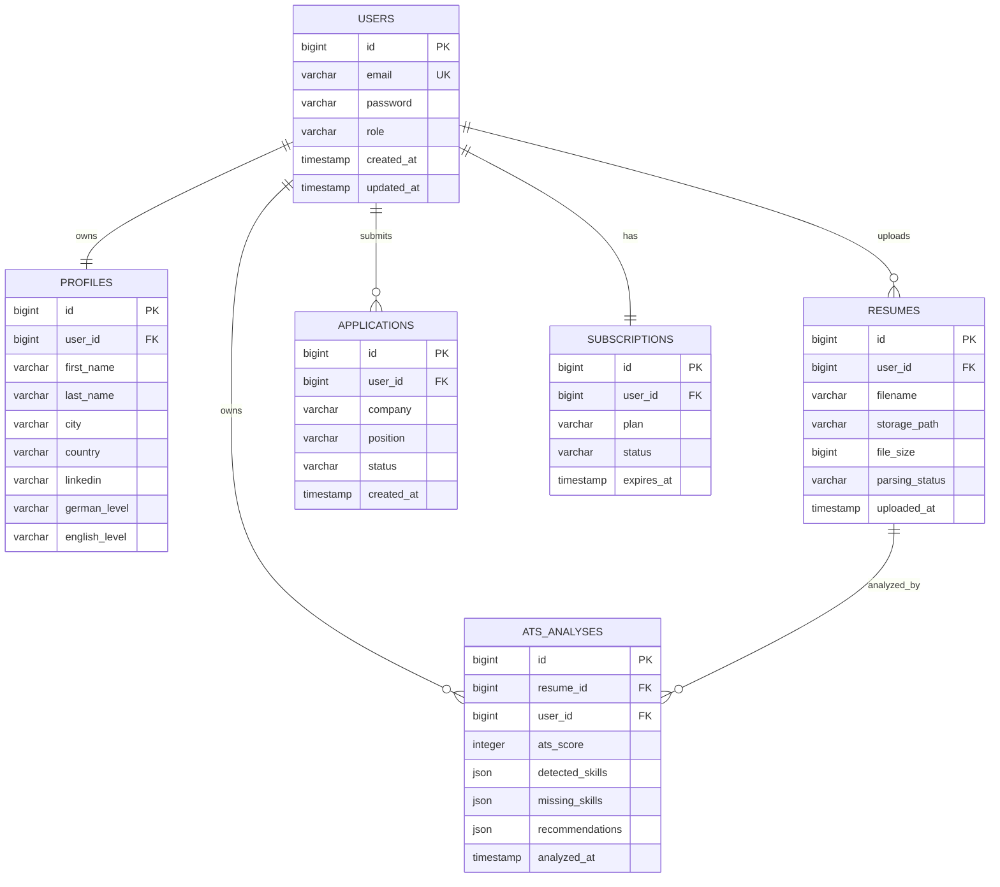

<!-- ========================================================= -->
<!-- CareerInDe -->
<!-- DATABASE CONTEXT -->
<!-- Version 1.0 -->
<!-- ========================================================= -->

# CareerInDe

# Database Context

> **Database Architecture, Data Model and Persistence Strategy**

---

# Document Metadata

| Property | Value |
|----------|-------|
| Project | CareerInDe |
| Product | CareerInDe |
| Document | Database Context |
| Version | 1.0 |
| Status | Living Document |
| Owner | Backend Team |
| Category | Technical Documentation |
| Purpose | Define the complete database architecture and persistence strategy |

---

# About this Document

This document defines the database architecture of CareerInDe.

Unlike implementation-specific SQL scripts, this document explains the business purpose behind every entity, relationship and persistence decision.

The objective is to ensure that the database remains consistent, scalable and maintainable throughout the lifecycle of the project.

Every schema change should be evaluated against the principles described in this document.

---

# Purpose

The CareerInDe database stores the complete professional identity of every user.

Rather than simply persisting application data, the database represents the user's evolving career journey.

The database must therefore support:

- User identity
- Authentication
- Professional profile
- Resume management
- ATS analysis
- AI recommendations
- Career planning
- Application tracking
- Future enterprise capabilities

---

# Database Philosophy

The database is designed according to several fundamental principles.

---

## Business First

Tables exist because of business requirements.

Database design should never be driven solely by technical convenience.

Every table must answer one question:

"What business capability does this table support?"

---

## Normalization

The schema should remain normalized whenever practical.

Goals

- Eliminate duplicate information.
- Improve consistency.
- Simplify maintenance.
- Reduce update anomalies.

Denormalization should only occur after measurable performance analysis.

---

## Long-Term Evolution

The database should evolve without breaking existing functionality.

New features should extend the schema rather than replacing existing structures whenever possible.

Backward compatibility should always be considered during migrations.

---

## Data Integrity

The database should guarantee data consistency through:

- Primary Keys
- Foreign Keys
- Unique Constraints
- Check Constraints
- Transactions
- Validation

Business-critical integrity must never depend exclusively on application code.

---

## Scalability

The schema should support future growth without requiring complete redesign.

Expected future additions include:

- Enterprise Organizations
- Recruiter Accounts
- Universities
- Multiple Resume Versions
- AI History
- Career Timeline
- Learning Progress
- Subscription Management

Current schema decisions should leave room for future expansion.

---

# Database Engine

Current Database

PostgreSQL

Reasons

- Open Source
- Excellent Spring Boot integration
- Strong ACID compliance
- JSON support
- Full-text search capabilities
- High performance
- Mature ecosystem

Future technologies may complement PostgreSQL but should not replace it without strong architectural justification.

---

# Database Architecture

The database follows a relational architecture.

```
Spring Boot

↓

Spring Data JPA

↓

Hibernate

↓

PostgreSQL

↓

Persistent Storage
```

All database communication occurs through Spring Data JPA repositories.

Direct SQL execution should be minimized.

---

# Persistence Strategy

CareerInDe uses Hibernate as the ORM layer.

Responsibilities

Hibernate

- Object Mapping
- Entity Lifecycle
- Lazy Loading
- Transactions
- Relationship Management

Spring Data JPA

- Repository Abstraction
- CRUD Operations
- Query Generation
- Pagination

Business logic should never depend on SQL syntax.

---

# Naming Conventions

Every database object follows a consistent naming strategy.

---

## Table Names

Plural

Examples

users

profiles

resumes

applications

subscriptions

ats_results

---

## Primary Keys

Every table uses

```
id
```

Type

```
BIGINT
```

Generated by

```
IDENTITY
```

---

## Foreign Keys

Naming

```
user_id

profile_id

resume_id
```

---

## Timestamp Columns

Recommended

```
created_at

updated_at
```

Future

```
deleted_at
```

for soft delete support.

---

# Database Principles

Every table should satisfy the following rules.

✓ Represents one business concept.

✓ Has a single primary key.

✓ Uses foreign keys instead of duplicated information.

✓ Avoids nullable fields whenever practical.

✓ Supports future extension.

✓ Maintains referential integrity.

✓ Includes auditing fields where appropriate.

---

# Current Core Entities

The MVP currently revolves around several core business entities.

Core Entities

- User
- Profile
- Resume
- ATSAnalysis
- Dashboard
- Role (Future)
- Subscription (Future)

Each entity represents a business capability rather than a technical object.

The following chapters describe each entity in detail, including attributes, relationships, constraints, business rules and future evolution.

---

# Entity: User

## Business Purpose

The User entity represents the digital identity of every registered CareerInDe user.

Every other business entity ultimately belongs to a User.

The User entity is considered the root aggregate of the platform.

Without a User, no other business capability can exist.

---

## Responsibilities

The User entity is responsible for:

- Authentication
- Authorization
- Identity
- Account Ownership
- Relationship Root

It is **not** responsible for:

- Resume Content
- ATS Results
- Career Planning
- Business Logic

---

## Current Fields

| Field | Type | Required | Description |
|--------|------|----------|-------------|
| id | Long | Yes | Primary Key |
| email | String | Yes | Login email |
| password | String | Yes | BCrypt hash |
| role | String | Yes | USER / ADMIN |

---

## Planned Fields

| Field | Description |
|---------|------------|
| enabled | Email verification status |
| emailVerified | Verification completed |
| lastLogin | Last successful login |
| failedLoginAttempts | Brute force protection |
| accountLocked | Security |
| createdAt | Audit |
| updatedAt | Audit |
| deletedAt | Soft Delete |

---

## Constraints

Email

- Required
- Unique
- Indexed

Password

- Never stored as plain text
- BCrypt only

Role

Current

USER

ADMIN

Future

RECRUITER

UNIVERSITY

ENTERPRISE_ADMIN

---

## Relationships

One User

↓

One Profile

One User

↓

Many Resumes

One User

↓

Many ATS Analyses

One User

↓

Many Applications

One User

↓

One Subscription (future)

---

## Lifecycle

Register

↓

Email Verification (future)

↓

Login

↓

Profile Completion

↓

Resume Upload

↓

Career Development

---

# Entity: Profile

## Business Purpose

The Profile entity stores structured professional information that cannot always be extracted from resumes.

The Profile becomes the central source of truth for CareerInDe's AI engine.

Unlike resumes, profile data is editable and continuously updated.

---

## Current Fields

| Field | Description |
|---------|------------|
| id | Primary Key |
| firstName | User first name |
| lastName | User last name |
| city | Current city |
| country | Country |
| about | About Me |
| linkedinUrl | LinkedIn profile |
| germanLevel | Language |
| englishLevel | Language |

---

## Planned Fields

Professional Title

Phone Number

Birth Year

Nationality

Visa Status

Preferred Location

Preferred Industry

Preferred Salary

Career Goal

Current Position

Years of Experience

Highest Education

Availability

Portfolio URL

GitHub URL

Website

Profile Photo

---

## Relationships

Profile

belongs to

User

Profile

references

many Resumes

Profile

references

many Career Goals

(future)

---

## Business Rules

Every User owns exactly one Profile.

Profile Completion is calculated dynamically.

AI recommendations improve as Profile completeness increases.

---

## Profile Completion

Profile completion contributes directly to the Dashboard.

Current formula (planned)

Personal Information

20%

Languages

20%

About Me

10%

LinkedIn

10%

Resume Uploaded

20%

Career Goal

20%

Maximum

100%

---

# Entity: Resume

## Business Purpose

The Resume entity represents one uploaded professional resume.

The resume becomes the primary input for ATS Analysis and AI recommendations.

---

## Current Fields

| Field | Description |
|---------|------------|
| id | Primary Key |
| filename | Original filename |
| storagePath | Server location |
| uploadedAt | Upload timestamp |

---

## Planned Fields

Resume Version

Language

Page Count

File Size

Checksum

Resume Status

Parsing Status

Last Analysis

AI Version

ATS Version

---

## Relationships

Resume

belongs to

User

Resume

has one

ATS Analysis

Resume

has many

AI Recommendations

Resume

has many

Resume Versions

(future)

---

## Resume Status

Possible states

UPLOADED

PARSING

PARSED

FAILED

ANALYZED

ARCHIVED

---

## Business Rules

Only PDF accepted.

Maximum upload size configurable.

One active resume during MVP.

Multiple resume versions introduced later.

Deleting a resume removes associated temporary analysis results.

---

# Entity: ATSAnalysis

## Business Purpose

Stores structured ATS evaluation results.

Each ATS Analysis corresponds to one resume.

The entity enables historical comparison and future analytics.

---

## Planned Fields

| Field | Description |
|---------|------------|
| id | Primary Key |
| atsScore | Overall Score |
| detectedSkills | JSON |
| missingSkills | JSON |
| recommendations | JSON |
| analyzedAt | Timestamp |
| aiProvider | AI Engine |
| analysisVersion | Version |

---

## Relationships

ATSAnalysis

belongs to

Resume

ATSAnalysis

belongs to

User

---

## Business Rules

ATS results are immutable.

Every new analysis creates a new record.

Historical comparisons remain available.

Future AI models should never overwrite previous analyses.

---

# Entity Relationship Overview

```
User

│

├────────────── Profile

│

├────────────── Resume

│                   │

│                   └──────── ATSAnalysis

│

├────────────── Application (future)

│

├────────────── Subscription (future)

│

└────────────── CareerGoal (future)
```

---

# Relationship Cardinality

User

1 → 1 Profile

User

1 → N Resume

User

1 → N ATSAnalysis

Resume

1 → N ATSAnalysis History

User

1 → N Applications

User

1 → 1 Subscription

Subscription

1 → N Payments

---

# Foreign Key Strategy

Every foreign key should follow the naming convention

```
user_id

resume_id

profile_id

subscription_id
```

Cascade delete should be used cautiously.

Preferred strategy

Soft delete for business entities.

Hard delete only for temporary records.

---

# Index Strategy

Initial indexes

users.email

users.role

profiles.user_id

resumes.user_id

ats_analysis.resume_id

ats_analysis.user_id

applications.user_id

Future indexes should be driven by query profiling rather than assumptions.

---


# Entity Relationship Diagram (ERD)

The following Entity Relationship Diagram represents the planned MVP architecture.



---

# Normalization Strategy

CareerInDe follows Third Normal Form (3NF).

## First Normal Form (1NF)

Every field stores a single atomic value.

Example

Correct

```
email = john@example.com
```

Incorrect

```
emails = john@example.com;jane@example.com
```

---

## Second Normal Form (2NF)

Every non-key attribute depends entirely on the primary key.

No partial dependencies are allowed.

---

## Third Normal Form (3NF)

Every non-key attribute depends only on the primary key.

Transitive dependencies should be removed.

Example

Incorrect

```
Resume

Country

CountryCode
```

Correct

```
Resume

country_id

↓

Country Table
```

---

# Constraints Strategy

Database constraints provide the final layer of data integrity.

Validation inside Java is important.

Validation inside PostgreSQL is mandatory.

---

## Primary Keys

Every table uses

```
BIGINT
```

Generated by

```
IDENTITY
```

No business meaning should be encoded into IDs.

---

## Foreign Keys

Every relationship should use foreign keys.

Benefits

- Referential Integrity

- Better Query Planning

- Consistent Data

---

## Unique Constraints

Current

```
users.email
```

Future

```
subscriptions.user_id

linkedin_profile

resume_checksum
```

---

## Check Constraints

Future examples

```
ATS Score

0 <= score <= 100
```

```
Subscription Status

FREE

PRO

PREMIUM

ENTERPRISE
```

```
Language Level

A1

A2

B1

B2

C1

C2
```

---

# Auditing Strategy

Every important entity should include auditing information.

Recommended fields

```
created_at

updated_at

created_by

updated_by
```

Future

```
deleted_at

deleted_by
```

Audit information supports

- Security

- Debugging

- Compliance

- Analytics

---

# Soft Delete Strategy

CareerInDe should avoid physical deletion for business entities.

Instead

```
deleted_at
```

is populated.

Benefits

- Recovery

- Audit History

- GDPR Management

- Analytics

Temporary data

may still be permanently removed.

Examples

Cache

Temporary Uploads

Logs

---

# Optimistic Locking

Future versions should introduce optimistic locking.

Example

```
@Version

private Long version;
```

Benefits

- Prevent Lost Updates

- Concurrent Editing Protection

- Better Scalability

---

# Migration Strategy

Database schema changes must be version controlled.

Recommended Tool

Flyway

Alternative

Liquibase

Migration Naming

```
V1__Initial_Schema.sql

V2__Create_Profile.sql

V3__Resume_Module.sql

V4__ATS_Module.sql

V5__Application_Module.sql
```

Schema changes must never be applied manually in production.

---

# Backup Strategy

Production backups should be fully automated.

Recommended schedule

Daily

Incremental

Weekly

Full Backup

Monthly

Archive

Backups must be encrypted.

Recovery procedures should be tested regularly.

---

# Query Optimization Strategy

Performance should always be measured before optimization.

General Guidelines

- Avoid N+1 Queries

- Use Fetch Joins carefully

- Apply Pagination

- Index frequently queried columns

- Select only required fields

Avoid

```
SELECT *
```

Prefer projections whenever possible.

---

# Lazy vs Eager Loading

Default

```
LAZY
```

Use

```
EAGER
```

only when absolutely necessary.

Benefits of Lazy Loading

- Lower Memory Usage

- Faster Queries

- Better Scalability

Improper eager loading may significantly reduce performance.

---

# Pagination Strategy

Every endpoint returning collections should support pagination.

Recommended defaults

Page Size

20

Maximum

100

Sorting

Configurable

Future Cursor Pagination

Large datasets

---

# JSON Storage Strategy

PostgreSQL JSONB may be used for semi-structured AI output.

Examples

Detected Skills

Missing Skills

AI Recommendations

Prompt Metadata

Advantages

Flexible schema evolution

Fast development

Reduced normalization

Business-critical information should still remain relational.

---

# File Storage Strategy

Resume files should never be stored inside PostgreSQL.

Instead

```
Database

↓

File Metadata

↓

Filesystem / Object Storage
```

Stored Metadata

Filename

Storage Path

Checksum

Size

Upload Date

Owner

Future

AWS S3

Azure Blob

MinIO

---

# Database Security

Security principles

- Least Privilege

- Prepared Statements

- Parameterized Queries

- No Dynamic SQL

- Encrypted Backups

- Restricted Database Accounts

Database credentials must never be committed to Git.

---

# Future Database Modules

The following tables are planned.

```
career_goals

career_progress

learning_paths

notifications

payments

organizations

recruiters

companies

interviews

job_offers

salary_reports

certificates

skills

languages

achievements

activity_logs

ai_history

prompt_history

resume_versions
```

These modules will be introduced incrementally as the platform evolves.

---

# Database Design Principles Summary

Every schema decision should satisfy the following questions.

✓ Does it support a real business capability?

✓ Is normalization appropriate?

✓ Can it scale?

✓ Is referential integrity preserved?

✓ Is migration safe?

✓ Is performance acceptable?

✓ Can AI modules extend it easily?

✓ Will this schema still make sense in five years?

If the answer to any question is **No**, the schema should be redesigned before implementation.

---

# End of Database Context

The Database Context defines the long-term persistence strategy of CareerInDe.

Every entity, relationship, migration and optimization should remain consistent with the principles described in this document.

The database is considered the persistent memory of the CareerInDe Career Operating System and must evolve carefully as the platform grows.
